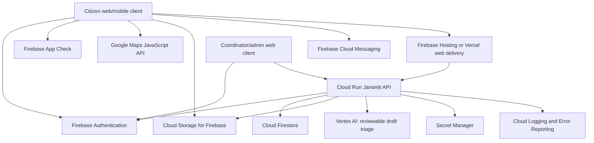

# Jananiti Google-Native Target Architecture

## Separation of responsibilities

| Layer | Google service | Jananiti responsibility |
|---|---|---|
| Identity | Firebase Authentication | Google sign-in, account linking, verified Firebase ID token. |
| Citizen/community data | Cloud Firestore | Civic items, immutable updates, public/private visibility, reactions, verifications, comments, badges, and notifications. |
| Evidence | Cloud Storage for Firebase | Private upload path, authenticated ownership checks, content-type/size validation, metadata in Firestore. |
| Trusted API | Cloud Run | Authorization, status guards, DRFI, attachment policy, admin actions, Firebase token verification. |
| Delivery | Firebase Hosting or Vercel | Static React client; Vercel must not hold privileged Google service credentials when Cloud Run owns backend APIs. |
| Map | Maps JavaScript API | Public records with intentionally shared approximate coordinates only; client fallback remains until restricted Maps key exists. |
| AI assistance | Vertex AI / Firebase AI Logic | JSON-only draft: category, short summary, missing-evidence prompts. Human confirmation remains mandatory. |
| Notifications | Firestore + FCM | Durable in-app Action Center first; opt-in push delivery second. |
| Security and observability | App Check, Security Rules, Secret Manager, Cloud Logging | Service boundaries, least privilege, auditability, abuse controls. |

## Migration sequence

1. Add Firebase Web App configuration and Firebase Auth while preserving existing identity links.
2. Add Firestore collections and Security Rules; migrate civic data with an auditable one-time script after a backup.
3. Move evidence objects to Cloud Storage and store only safe metadata in Firestore.
4. Deploy current API logic to Cloud Run, verify Firebase ID tokens, and move privileged operations there.
5. Replace current maps fallback only after restricted Maps browser key works in staging.
6. Add FCM and Vertex AI as opt-in enhancements; retain in-app notices and deterministic DRFI as the canonical baseline.
7. Remove Manus-specific production code only after data parity, access controls, and rollback validation pass.

## Explicit non-negotiable rules

- Firebase client configuration is public runtime configuration; server credentials and private keys are not.
- Cloud Run should use its attached service identity and Secret Manager, not a service-account JSON file committed to GitHub.
- Firestore and Cloud Storage rules must default to deny and open only the documented citizen/admin paths.
- Vertex AI output cannot change DRFI, status, or evidence state automatically.
- JanaNiti must not collect raw Aadhaar, VID, OTP, biometrics, or e-KYC payloads.
